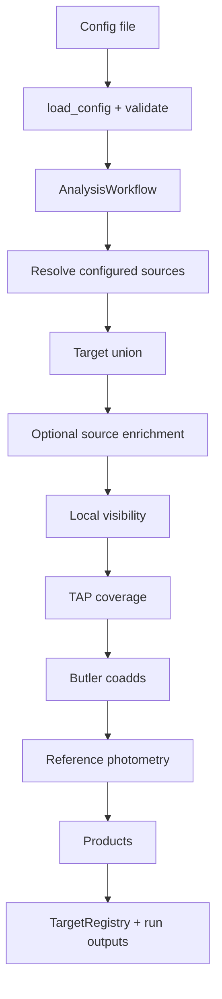
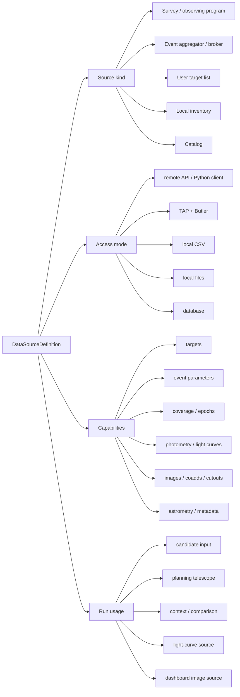
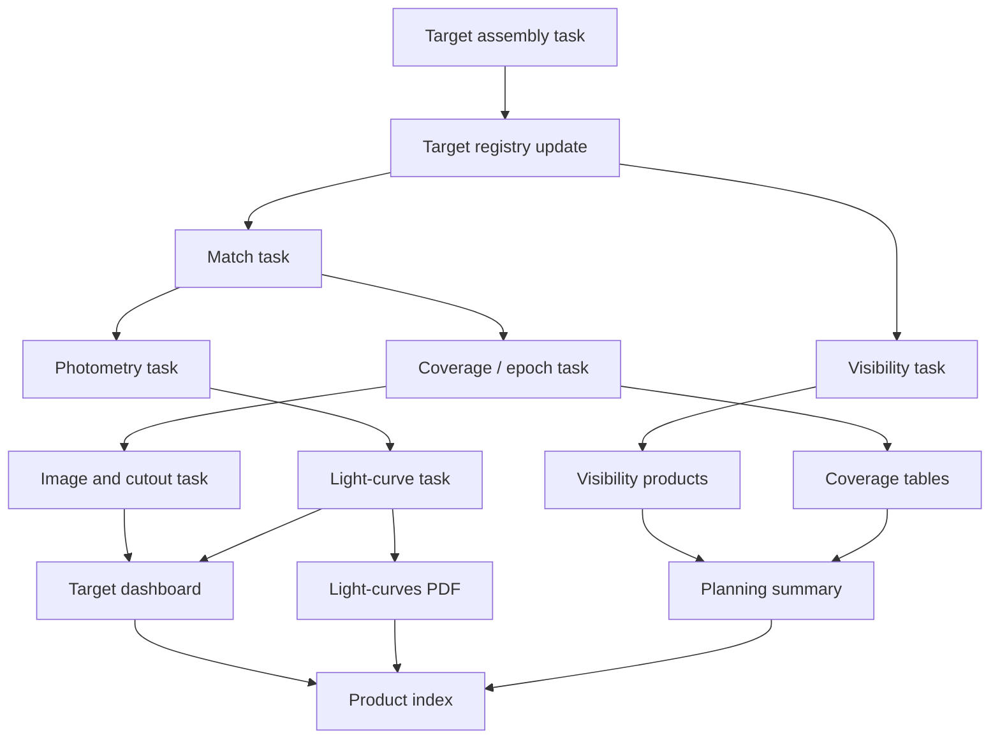
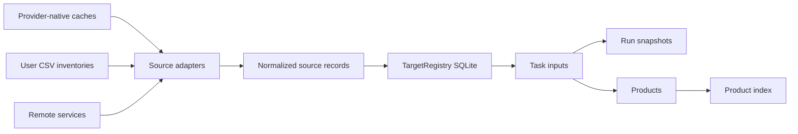

# Target Selection Architecture Proposal

This document describes how the current tool is organized and proposes a cleaner structure for the next refactor. The goal is to make the code flexible enough to combine target/event aggregators, astronomical surveys, local observing inventories, Rubin collections, and user-provided target lists without adding one-off keywords for every new source.

## Current organization

The current application already has the right top-level idea: a declarative configuration is loaded into `AnalysisConfig`, selected sources are resolved through adapters, the workflow builds a target union, and configured products are generated. The persistent `TargetRegistry` stores normalized identities, source records, observations, photometry, refresh state, and run metadata.

The most important modules are:

| Module | Current responsibility |
|---|---|
| `target_selection.config` | Typed TOML/JSON configuration and validation. |
| `target_selection.sources` | Adapter protocols and built-in adapters for MOP, HSH, CSV, and Rubin. |
| `target_selection.workflow` | Orchestrates configured sources and dispatches Rubin/Data Release runs. |
| `target_registry` | SQLite persistence for targets, aliases, source records, epochs, photometry, and run records. |
| `target_selection_pipeline` | Large Rubin-oriented backend: MOP visible targets, HSH merge, visibility, TAP coverage, Butler coadds, photometry, summaries, sky maps, and target reports. |
| `visibility_plotter` | Local visibility physics and plots. |
| `release_photometry` | Rubin coadd-forced and DIA forced-source photometry. |
| `target_report`, `monitoring_report`, `observing_selection_summary` | Visualization products. |
| `target_selection.reference_catalog` | Large reference-catalog enrichment and cutout workflow. |

## Current flow



This works, but the lower half is still too centralized. `target_selection_pipeline.py` knows about many concerns at once: MOP visibility, local HSH history, Rubin coverage, coadd discovery, DIA photometry, target dashboards, summary tables, sky maps, and run manifests.

## Main conceptual issue to fix

The previous proposal separated sources into `target_provider`, `followup_survey`, and `reference_survey`. That separation is useful for describing how a source is used in one run, but it is not a good core data model.

A survey is still a survey even if it was designed for follow-up, alerts, or wide-field imaging. HSH, JS, LSST/Rubin, ZTF, OGLE, and Gaia can all be represented as surveys or observing programs. What changes is which data they provide and how the code accesses those data.

MOP and OMP are different: they are event/target aggregators. They collect or publish candidate microlensing events from several surveys. They can provide target lists, event parameters, current magnitude, and photometry, but they are not the same kind of object as HSH or Rubin.

A better model should separate four ideas:

1. **What the source is**: survey, event aggregator, user target list, local inventory, catalog.
2. **What data it can provide**: targets, event parameters, coverage, epochs, photometry, images, coadds, cutouts, astrometry, metadata.
3. **How data are obtained**: Python API, web/API request, TAP/Butler, local CSV, local image files, database, or hybrid.
4. **How the source is used in the current run**: candidate input, planning telescope, comparison/context survey, photometry source, image source, dashboard source.

This avoids hard-coding concepts like “reference survey” and “follow-up survey” as separate source classes. Those terms remain useful as run-level usage labels, not as fundamental source types.

## Proposed source model



Recommended source kinds:

| Source kind | Meaning | Examples |
|---|---|---|
| `survey` | Observing survey or observing program. It may be wide-field, alert-based, follow-up, or archival. | Rubin/LSST DP1-DP2, ZTF, Gaia, OGLE, CASLEO/HSH, CASLEO/JS. |
| `event_aggregator` | System that aggregates, curates, or publishes targets/events from one or more surveys. | MOP, future OMP. |
| `user_target_list` | User-provided list of targets to analyze. | CSV with name, RA, Dec, optional metadata. |
| `local_inventory` | Local observation/image inventory for one survey or telescope. | HSH `image_collection_astro.csv`, future JS inventory. |
| `catalog` | Static external catalog used for matching or enrichment. | LaStBeRu catalog, selected Rubin object catalog. |

Recommended capabilities:

| Capability | Meaning |
|---|---|
| `targets` | Provides target names and coordinates. |
| `event_parameters` | Provides microlensing or transient parameters such as `t_0`, `t_E`, `u_0`, `mag_now`, or priority. |
| `coverage` | Provides whether a position was observed and how many visits/images exist. |
| `epochs` | Provides observation dates, exposure time, band, seeing, magnitude limit, or similar per-image/per-visit metadata. |
| `photometry` | Provides measured light-curve points. |
| `objects` | Provides catalog objects or DIA objects that can be matched to targets. |
| `images` | Provides individual images, coadds, cutouts, or image metadata. |
| `astrometry` | Provides accurate positions or proper motions. |

Recommended access modes:

| Access mode | Meaning | Examples |
|---|---|---|
| `python_api` | Native Python client or local package. | `mop_api`. |
| `http_api` | Web request or REST-like access. | Future OMP, ZTF if implemented that way. |
| `tap_butler` | Rubin RSP TAP queries plus Butler datasets. | Rubin DP1/DP2. |
| `local_csv` | User-provided table read from disk. | HSH inventory, user target list, user photometry. |
| `local_files` | FITS/images or reduced products on disk. | HSH/JS calibrated images. |
| `database` | Persistent internal or external database. | `TargetRegistry`, future local survey DB. |

Run usage should be selected independently from source definition. For example, Rubin DP2 can be used as a context survey, photometry source, and dashboard image source in one run. HSH can be used as a planning telescope and as an observed-photometry source. MOP can be used as a candidate input and event-parameter source.

## Example normalized source definitions

```toml
[sources.mop]
kind = "event_aggregator"
access = "python_api"
capabilities = ["targets", "event_parameters", "photometry"]

[sources.casleo_hsh]
kind = "survey"
observing_program = "follow_up"
access = "local_csv"
capabilities = ["targets", "coverage", "epochs", "images", "photometry"]
path = "/path/to/image_collection_astro.csv"

[sources.rubin_dp2]
kind = "survey"
observing_program = "wide_field"
access = "tap_butler"
capabilities = ["coverage", "epochs", "objects", "photometry", "images", "coadds", "cutouts"]
data_release = "DP2"

[sources.user_targets]
kind = "user_target_list"
access = "local_csv"
capabilities = ["targets"]
path = "targets.csv"
```

Example run usage:

```toml
[use]
candidate_inputs = ["mop", "user_targets"]
planning_surveys = ["casleo_hsh"]
context_surveys = ["rubin_dp2"]
photometry_sources = ["mop", "casleo_hsh", "rubin_dp2"]
image_sources = ["rubin_dp2"]
```

This is more extensible than adding a new global keyword every time a source is added. To add ZTF or Gaia, the developer defines a new source adapter with capabilities and access mode. The user then decides how to use it in a run.

## Proposed task model

Instead of one large pipeline that decides everything, use composable tasks. Each task declares required inputs, optional inputs, outputs, and compatible source capabilities.



Recommended tasks:

| Task | Inputs | Outputs |
|---|---|---|
| `targets` | Candidate-input sources, local survey inventories, explicit user targets. | Canonical target table with provenance. |
| `match` | Canonical targets and selected source catalogs/objects. | Match table with angular separation, ambiguity flags, selected counterpart IDs. |
| `visibility` | Targets, observatory, dates, observing windows, altitude criteria. | Per-night visibility table and optional plots. |
| `coverage` | Targets and selected surveys/collections. | Coverage rows and compact summary counts. |
| `photometry` | Targets, matches, selected photometry-capable sources. | Normalized light-curve table. |
| `images` | Targets, image-capable sources, selected bands. | Coadd/cutout metadata and optional FITS/PNG cutouts. |
| `dashboard` | Targets, coverage, images, photometry, matches. | Shared target report PNGs. |
| `planning_summary` | Targets, visibility, stages, coverage, observations. | Observing selection table/PNG. |
| `lightcurves_report` | Targets and selected photometry/epoch sources. | Multi-page light-curves PDF. |

## Proposed data ownership



Keep provider-native files where they are efficient, but store normalized facts in one registry:

- target identity and aliases;
- authoritative coordinates and coordinate provenance;
- event parameters by source;
- observations/epochs by survey;
- photometry by source, band, and measurement method;
- matches to external catalogs or DIA objects;
- coverage summaries by source/collection;
- image/cutout metadata;
- run records and refresh state.

Run folders should contain reproducible snapshots and products, not a second copy of every persistent dataset.

## Proposed config shape

The config should stay source-neutral. Source definitions describe available data. The run section describes which sources are used and why.

```toml
[run]
name = "hsh_report"
start_date = "2026-08-14"
end_date = "2026-08-14"
observatory = "El Leoncito"
output_dir = "outputs"

[use]
candidate_inputs = ["mop"]
planning_surveys = ["casleo_hsh"]
context_surveys = ["rubin_dp2"]
photometry_sources = ["mop", "casleo_hsh", "rubin_dp2"]
image_sources = ["rubin_dp2"]

[selection]
target_names = ["OGLE-2025-BLG-1121"]
target_data_scope = "with_data"
maximum_current_magnitude = 18.5
bands = ["g", "r", "i", "z"]

[selection.visibility]
enabled = false
minimum_altitude_deg = 40.0
minimum_observable_minutes = 90.0
observing_windows = ["20:30", "07:00"]

[tasks]
match = true
coverage = true
photometry = true
images = true
visibility = false
planning_summary = false
lightcurves_report = false
target_dashboard = true

[products]
target_reports = true
lightcurves_pdf = false
sky_maps = false
observing_selection_summary = false
visibility_plots = false

[sources.rubin_dp2]
kind = "survey"
access = "tap_butler"
data_release = "DP2"
capabilities = ["coverage", "epochs", "objects", "photometry", "coadds", "cutouts"]
photometry_method = "dia_forced_catalog"
```

The exact keyword names can change, but the important point is that tasks should be explicit. Turning off visibility should mean no visibility calculation and no visibility products. Selecting a target subset should affect every task.

## Functional tags

Tags can make common configurations easier to communicate, document, and eventually validate.

| Tag | Meaning |
|---|---|
| `source:survey` | Use data from an observing survey/program. |
| `source:aggregator` | Use data from an event or target aggregator. |
| `source:local-csv` | Use a local CSV as a source. |
| `targets:mop-visible` | Include targets returned by MOP for the requested dates. |
| `targets:observed` | Include targets observed by selected surveys such as HSH or JS. |
| `targets:user-list` | Include a user-provided CSV target list. |
| `targets:subset` | Restrict all tasks to explicit target names. |
| `match:catalog` | Match targets to a source catalog or object table. |
| `visibility:local` | Compute local observability for selected dates/windows. |
| `coverage:survey` | Query coverage from selected surveys/collections. |
| `photometry:mop` | Add MOP photometry. |
| `photometry:survey` | Add photometry from selected surveys. |
| `photometry:dia` | Add Rubin DIA forced-source light curves. |
| `photometry:coadd-forced` | Add coadd forced photometry. |
| `images:coadd` | Find coadds containing each target. |
| `images:cutout` | Create PNG/FITS cutouts. |
| `product:dashboard` | Update shared target report PNGs. |
| `product:lightcurves` | Create a multi-target light-curve PDF. |
| `product:planning-table` | Create the observing selection summary. |
| `product:visibility-plots` | Create nightly visibility plots. |

## Refactor recommendation

The current structure is good enough to keep using. A full rewrite is not recommended. The best path is an incremental refactor that preserves `run_analysis(config)` and the existing notebooks.

Recommended phases:

1. Define normalized source interfaces around **kind**, **access mode**, and **capabilities**. Do not hard-code `reference_survey` and `followup_survey` as incompatible source classes.
2. Define capability protocols: `TargetProvider`, `EventDataProvider`, `CoverageProvider`, `EpochProvider`, `PhotometryProvider`, `ObjectCatalogProvider`, `ImageProvider`, and `CutoutProvider`.
3. Move Rubin-specific work out of `target_selection_pipeline.py` into task modules: `tasks.coverage`, `tasks.photometry`, `tasks.images`, and `tasks.dashboard`.
4. Promote MOP enrichment and photometry into provider capabilities instead of treating MOP as a special backend dependency.
5. Store match results and reference photometry in the registry with explicit source, method, collection, counterpart ID, separation, status, and version.
6. Replace product booleans with task/product groups while keeping old keywords as compatibility aliases.
7. Add a small task planner that decides which tasks are required from selected products and requested capabilities.
8. Keep the shared `target_reports/` folder and persistent per-target caches; make reports update by target, not by date-specific run.

## What should not be changed yet

- Do not remove the current low-level `run_target_selection` backend until the new task modules cover all existing products.
- Do not split surveys into fundamentally different source classes only because one is used as follow-up and another as context. Those are run-level usages.
- Do not force every native cache into SQLite. Large service responses and image products are often better as files with registry metadata.
- Do not require local visibility for dashboard-only or photometry-only runs.

## Short conclusion

The cleaner model is: **data sources have a kind, access mode, and capabilities; each run decides how to use them**. This matches the real science workflow better than rigid categories such as reference survey versus follow-up survey. It also keeps the tool ready for OMP, ZTF, Gaia, JS, additional Rubin collections, local photometry CSVs, and future user catalogs.
