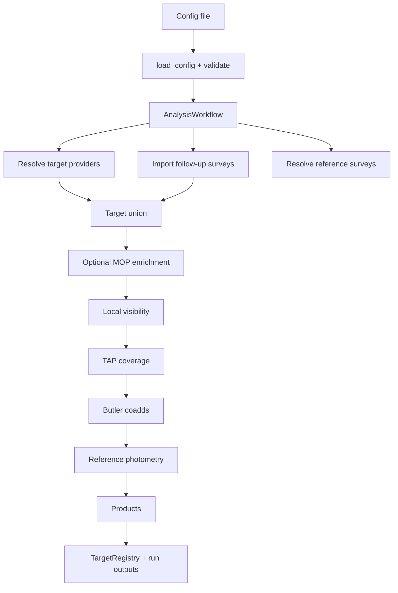
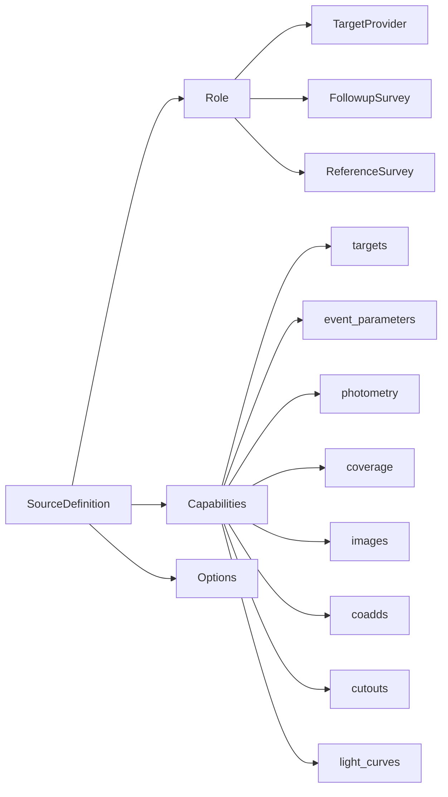
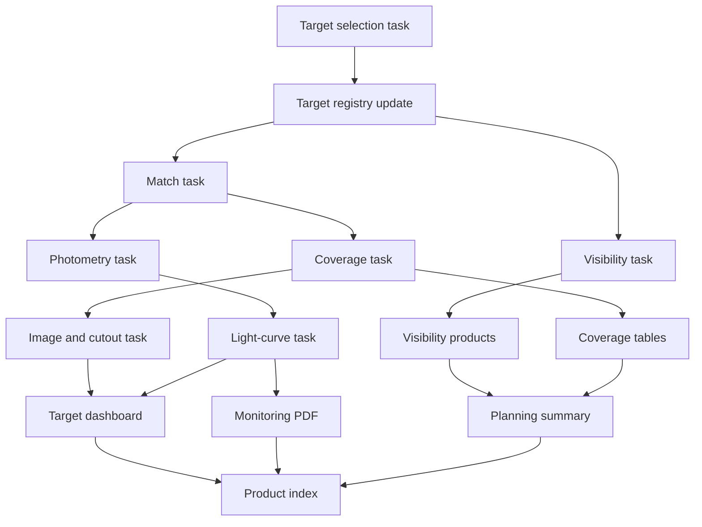
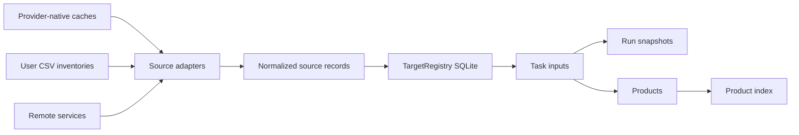

# Target Selection Architecture Proposal

This document describes how the current tool is organized and proposes a cleaner structure for the next refactor. The goal is to make target providers, observing surveys, reference surveys, matching tasks, visibility products, light curves, and dashboards easier to combine without adding one-off keywords for every new source.

## Current organization

The current application already has the right top-level idea: a declarative configuration is loaded into `AnalysisConfig`, selected sources are resolved through adapters, the workflow builds a target union, and configured products are generated. The persistent `TargetRegistry` stores normalized identities, source records, observations, photometry, refresh state, and run metadata.

The most important modules are:

| Module | Current responsibility |
|---|---|
| `target_selection.config` | Typed TOML/JSON configuration and validation. |
| `target_selection.sources` | Adapter protocols and built-in adapters for MOP, HSH, CSV, and Rubin. |
| `target_selection.workflow` | Orchestrates configured sources and dispatches reference-survey runs. |
| `target_registry` | SQLite persistence for targets, aliases, source records, epochs, photometry, and run records. |
| `target_selection_pipeline` | Large DP/Rubin-oriented backend: MOP visible targets, HSH merge, visibility, TAP coverage, Butler coadds, photometry, summaries, sky maps, and target reports. |
| `visibility_plotter` | Local visibility physics and plots. |
| `release_photometry` | Rubin coadd-forced and DIA forced-source photometry. |
| `target_report`, `monitoring_report`, `observing_selection_summary` | Visualization products. |
| `target_selection.reference_catalog` | Large reference-catalog enrichment and cutout workflow. |

## Current flow



This works, but the lower half is still too centralized. `target_selection_pipeline.py` knows about many concerns at once: MOP visibility, local HSH history, Rubin coverage, coadd discovery, DIA photometry, target dashboards, summary tables, sky maps, and run manifests.

## Main issue to fix

The current roles are useful but not expressive enough for what the project is becoming. A source can provide several kinds of data. For example:

- MOP is a target provider, but also provides event parameters and photometry.
- HSH and JS are follow-up surveys, but can provide observations now and calibrated photometry later.
- Rubin DP1/DP2 are reference surveys, but can provide coverage, object catalogs, DIA light curves, coadds, cutouts, and possibly forced photometry.
- OGLE, Gaia, ZTF, OMP, and future systems may act as candidate providers, photometry providers, or both.

A better model should describe both the source role and the data capabilities it offers.

## Proposed source model



Roles answer why a source participates in the analysis. Capabilities answer what data the source can provide.

Recommended normalized roles:

| Role | Meaning | Examples |
|---|---|---|
| `target_provider` | Proposes candidate targets/events. | MOP, OMP, user CSV, selected Rubin object table. |
| `followup_survey` | Represents the observing program being planned or evaluated. | CASLEO/HSH, CASLEO/JS. |
| `reference_survey` | Adds contextual survey information around targets. | Rubin DP1, Rubin DP2, DES, Gaia archive, ZTF archive. |
| `photometry_provider` | Supplies light-curve points but does not necessarily propose targets. | OGLE, Gaia alerts, ZTF, local reduced HSH/JS photometry. |

A single adapter may expose more than one capability. The config should select sources by name, not by adding new global booleans.

## Proposed task model

Instead of one large pipeline that decides everything, use composable tasks. Each task declares required inputs, optional inputs, outputs, and compatible source capabilities.



Recommended tasks:

| Task | Inputs | Outputs |
|---|---|---|
| `targets` | Selected target providers, follow-up surveys, user subset. | Canonical target table with provenance. |
| `match` | Canonical targets and one or more source catalogs. | Match table with angular separation, ambiguity flags, selected counterpart IDs. |
| `visibility` | Targets, observatory, dates, observing windows, altitude criteria. | Per-night visibility table and optional plots. |
| `coverage` | Targets and selected surveys/collections. | Coverage rows and compact summary counts. |
| `photometry` | Targets, matches, selected photometry-capable sources. | Normalized light-curve table. |
| `images` | Targets, image-capable sources, selected bands. | Coadd/cutout metadata and optional FITS/PNG cutouts. |
| `dashboard` | Targets, coverage, images, photometry, matches. | Shared target report PNGs. |
| `planning_summary` | Targets, visibility, stages, coverage, observations. | Observing selection table/PNG. |
| `monitoring_report` | Targets and selected photometry/epoch sources. | Multi-page light-curves PDF. |

## Proposed data ownership



Keep provider-native files where they are efficient, but store normalized facts in one registry:

- target identity and aliases;
- authoritative coordinates and coordinate provenance;
- event parameters by source;
- observations/epochs by survey;
- photometry by source, band, and measurement method;
- matches to external catalogs or DIA objects;
- coverage summaries by source/collection;
- image/cutout metadata;
- run records and refresh state.

Run folders should contain reproducible snapshots and products, not a second copy of every persistent dataset.

## Proposed config shape

The config should stay source-neutral. A user should choose sources, filters, tasks, and products independently.

```toml
[run]
name = "hsh_report"
start_date = "2026-08-14"
end_date = "2026-08-14"
observatory = "El Leoncito"
output_dir = "outputs"

[sources]
target_providers = []
followup_surveys = ["casleo_hsh"]
reference_surveys = ["rubin_dp2"]
photometry_providers = ["mop"]

[selection]
target_names = ["OGLE-2025-BLG-1121"]
target_data_scope = "with_data"
maximum_current_magnitude = 18.5
bands = ["g", "r", "i", "z"]

[selection.visibility]
enabled = false
minimum_altitude_deg = 40.0
minimum_observable_minutes = 90.0
observing_windows = ["20:30", "07:00"]

[tasks]
match = true
coverage = true
photometry = true
images = true
visibility = false
planning_summary = false
monitoring_report = false
target_dashboard = true

[products]
target_reports = true
monitoring_report = false
sky_maps = false
observing_selection_summary = false
visibility_plots = false

[reference_surveys.rubin_dp2]
adapter = "rubin"
data_release = "DP2"
capabilities = ["coverage", "coadds", "cutouts", "dia_light_curves"]
photometry_method = "dia_forced_catalog"
```

The exact keyword names can change, but the important point is that tasks should be explicit. Turning off visibility should mean no visibility calculation and no visibility products. Selecting a target subset should affect every task.

## Functional tags

Tags can make common configurations easier to communicate, document, and eventually validate.

| Tag | Meaning |
|---|---|
| `targets:mop-visible` | Include targets returned by MOP for the requested dates. |
| `targets:followup-observed` | Include targets observed by selected follow-up surveys. |
| `targets:user-list` | Include a user-provided CSV target list. |
| `targets:subset` | Restrict all tasks to explicit target names. |
| `match:catalog` | Match targets to a source catalog or object table. |
| `visibility:local` | Compute local observability for selected dates/windows. |
| `coverage:survey` | Query coverage from selected surveys/collections. |
| `photometry:mop` | Add MOP photometry. |
| `photometry:dia` | Add Rubin DIA forced-source light curves. |
| `photometry:coadd-forced` | Add coadd forced photometry. |
| `images:coadd` | Find coadds containing each target. |
| `images:cutout` | Create PNG/FITS cutouts. |
| `product:dashboard` | Update shared target report PNGs. |
| `product:lightcurves` | Create a multi-target light-curve PDF. |
| `product:planning-table` | Create the observing selection summary. |
| `product:visibility-plots` | Create nightly visibility plots. |

## Refactor recommendation

The current structure is good enough to keep using. A full rewrite is not recommended. The best path is an incremental refactor that preserves `run_analysis(config)` and the existing notebooks.

Recommended phases:

1. Define normalized capability protocols: `TargetProvider`, `EventDataProvider`, `CoverageProvider`, `PhotometryProvider`, `ImageProvider`, and `CutoutProvider`.
2. Move Rubin-specific work out of `target_selection_pipeline.py` into task modules: `tasks.coverage`, `tasks.photometry`, `tasks.images`, and `tasks.dashboard`.
3. Promote MOP enrichment and photometry into provider capabilities instead of treating MOP as a special backend dependency.
4. Store match results and reference photometry in the registry with explicit source, method, collection, counterpart ID, separation, status, and version.
5. Replace product booleans with task/product groups while keeping old keywords as compatibility aliases.
6. Add a small task planner that decides which tasks are required from selected products and requested capabilities.
7. Keep the shared `target_reports/` folder and persistent per-target caches; make reports update by target, not by date-specific run.

## What should not be changed yet

- Do not remove the current low-level `run_target_selection` backend until the new task modules cover all existing products.
- Do not collapse target providers, follow-up surveys, and reference surveys into a single generic source type in the user-facing config. The semantic roles are useful.
- Do not force every native cache into SQLite. Large service responses and image products are often better as files with registry metadata.
- Do not require local visibility for dashboard-only or photometry-only runs.

## Short conclusion

The best architecture is source-role based, capability-aware, and task-driven. The existing adapter/config work is already moving in that direction. The main next step is to split the monolithic Rubin/product backend into reusable task modules while preserving the current public API and notebooks.
