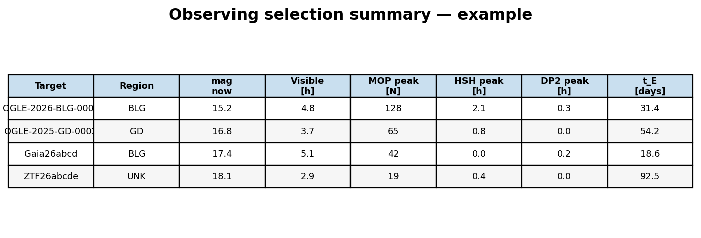
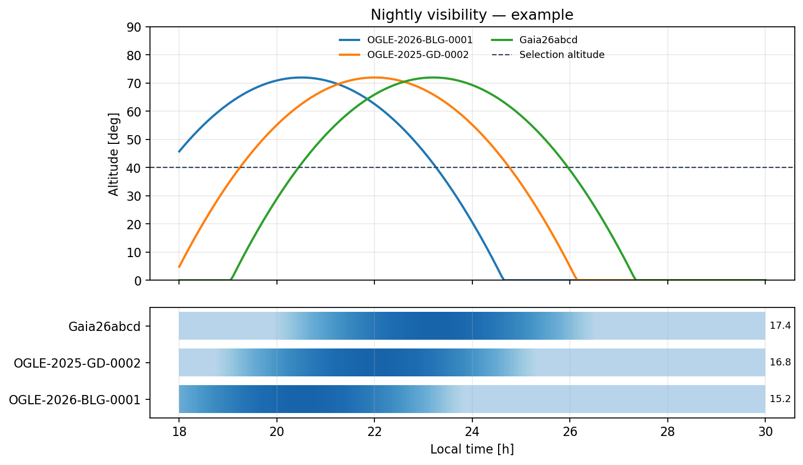
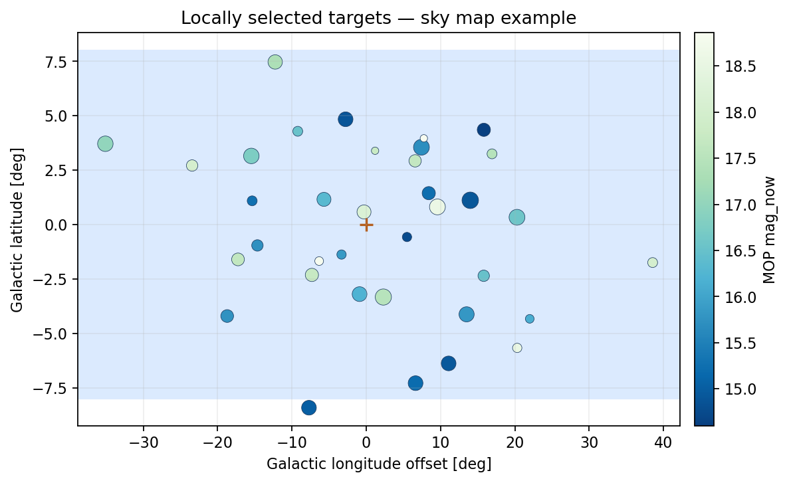
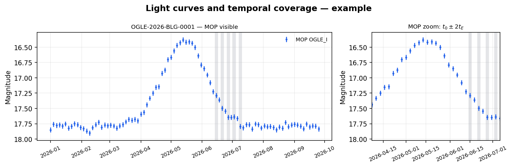
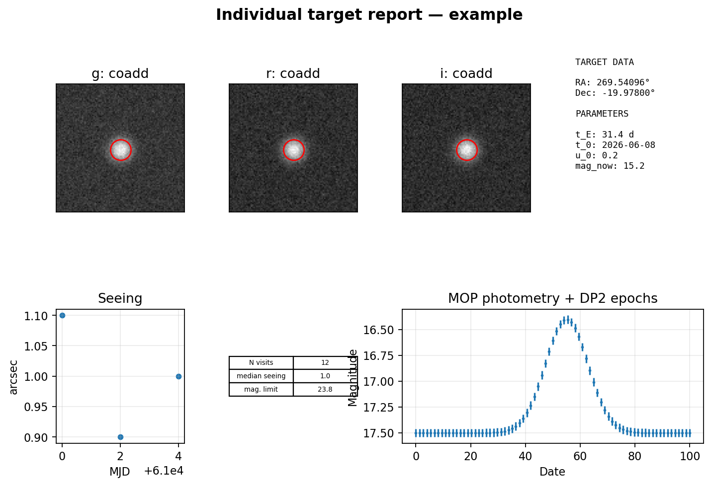

# Product examples

These deliberately synthetic examples illustrate the structure of the main
visual products. A real run writes the corresponding files under its own
output directory; use `product_index.json` to find the files that exist for
that run.

## Observing-selection summary

`tables/observing_selection_summary.png` is the compact planning table. It
sorts locally observable targets by `mag_now`, identifies their region, and
shows time spent in each microlensing stage by MOP, follow-up surveys, and the
selected reference survey.

{ width="900" }

## Nightly visibility

`visibility_plots/YYYY-MM-DD_visibility.png` contains altitude curves and a
binned altitude strip. It includes only targets that pass the configured
astronomical-night, allocation, altitude, and duration cuts.

{ width="820" }

## Sky maps

When a reference survey is selected, `sky_plots/` contains an all-sky map and
a bulge zoom. Target markers encode the configured metrics, normally current
MOP magnitude and reference-survey visit coverage.

{ width="760" }

## Light curves and temporal coverage

`monitoring_reports/lightcurves.pdf` provides one target per row: the primary
light curve on the left and a `t_0 ± 2 t_E` panel on the right when MOP
parameters exist. Its shaded lanes mark epochs from Rubin and follow-up
surveys; local-survey photometry replaces its own shading when available.

{ width="900" }

## Individual Rubin target report

With `target_reports = true`, `target_reports/<Target>_target_report.png` combines
deep coadds, zooms, visit statistics, target metadata, and MOP/reference
photometry. No report is written for a target without a suitable coadd.

{ width="1000" }

## Tables and machine-readable products

Every visual product has a nearby CSV where applicable. The main entry points
are `tables/combined_targets.csv` (reference-survey runs), `tables/targets.csv`
(planning-only runs), `tables/visibility_target_summary.csv`, and
`tables/observing_selection_summary.csv`. See [Products](products.md) for the
complete directory guide.
